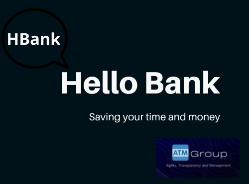

<div align="center">

# **Hello Bank**

</div>

<div align="center">



</div>

Desafio Final do Treinamento "If Black Then Code" da Gama Academy em conjunto com a IBM.

O desafio consiste na construção de uma API para um banco fictício que irá gerenciar transações entre contas e colocá-lo em nuvem (AWS).

<br>

## 📑 Arquitetura do Projeto

```
├──📁 HELLOBANK
    ├──📁 src
    |   └─ 📁 main
    |   |   └─ 📁 java\com\helloBank\desafio
    |   |   |   └─ 📁 controllers
    |   |   |   |   └─📄ClienteController.java 
    |   |   |   |   └─📄ContaController.java 
    |   |   |   |   └─📄TransacaoController.java 
    |   |   |   └─ 📁 models
    |   |   |   |   └─📄Cliente.java  
    |   |   |   |   └─📄Conta.java 
    |   |   |   |   └─📄Transacao.java   
    |   |   |   └─ 📁 repositories
    |   |   |   |   └─📄ClienteRepo.java  
    |   |   |   |   └─📄ContaRepo.java 
    |   |   |   |   └─📄TransacaoRepo.java 
    |   |   |   └─ 📁 Services
    |   |   |   |   └─📄ClienteService.java  
    |   |   |   |   └─📄ContaService.java 
    |   |   |   |   └─📄TransacaoService.java 
    │   |   |   └─📄HelloBankApplication.java    
    |   |   └─ 📁 resources   
    |   |   |   └─📄Application.properties
    |   └─ 📁 test\java\com\grupo01\helloBank
    |   |   └─ 📁 controllers
    |   |   |   └─📄ClientesControllerTests.java
    |   |   └─ 📁 libs
    |   |   |   └─📄httpRequests.java
    |   |   └─ 📁 models
    |   |   |   └─📄 ClientesTests.java
    |   |   |   └─📄 ContasTests.java
    |   |   |   └─📄 TransacoesTests.java
    |   |   └─ 📁 repositories
    |   |   |   └─📄 ClientesRepoTests.java
    |   |   |   └─📄 ContasRepoTests.java
    |   |   |   └─📄 TransacoesRepoTests.java
    |   |   └─📄 HellobankApplicationTests.java
    ├─📄.gitignore 
    ├─📄 HelloBankDiagram.jpg      
    ├─📄 README.md  
    ├─📄 pom.xml
    ├─📄 run.sh
    └─📄 start.sh
```

## 🛣️ Rotas
<br>

### Métodos POST/GET/PUT/DELETE - *Clientes* 
<br>

<div align = "center">

|  Método  |                  Rota                       |                     Descrição                                |
| :------: | :-------------------------------------:     | :-------------------------------------------------------:    |
|  `POST`  | localhost:8080/clientes                 |    Cadastra novo cliente                  |
|  `GET`   | localhost:8080/clientes                   |    Lista de todos os clientes                        |
|  `GET`   | localhost:8080/clientes/:id                 |             Busca cliente por número de registro                                     |
|   `PUT`  |  localhost:8080/clientes/:id        |       Atualizar os dados dos clientes buscando por ID                  |
| `DELETE` |  localhost:8080/clientes/:id        |                      Deletar registro de cliente buscando por ID          |

</div>
<br>

### Métodos POST/GET - *Conta* 
<br>

<div align = "center">

|  Método  |                  Rota                       |                     Descrição                                |
| :------: | :-------------------------------------:     | :-------------------------------------------------------:    |
|  `POST`  | localhost:8080/conta                 |    Cadastra nova conta                  |
|  `GET`   | localhost:8080/conta/:id                 |             Busca conta por número de cpf do cliente                                     |


</div>
<br>

### Métodos POST/GET - *Transação* 
<br>

<div align = "center">

|  Método  |                  Rota                       |                     Descrição                                |
| :------: | :-------------------------------------:     | :-------------------------------------------------------:    |
|  `POST`  | localhost:8080/transacao                 |    Cadastra nova transação                  |
|  `GET`   | localhost:8080/transacao                   |    Lista de todos as transações do cliente                        |

</div>
<br>

## 📚 Documentação da API
<br>

- Para ver como resultam as pesquisas, acesse o **Swagger** através do link da [AWS](http://52.53.130.152:8082/swagger-ui/index.html)

- A metodologia ágil utilizada para organização e monitoramento do processo do projeto foi feita pelo método Kanban e pode ser vista no [Trello](https://trello.com/b/dUaPJsSW/desafiofinal).


<br>

## 💻 Tecnologias Utilizadas
<br>


<br>

[](https://git-scm.com/)
<br>


<br>


<br>


<br>


<br>


<br>


<br>


## 👩🏿‍🤝‍👨🏾 DESENVOLVIDO POR:

<div align="justify">


</div>
<br>

- [Bruno Moura](https://www.linkedin.com/in/brunomoura22/)
<br>

- [Eliza Pimentel](https://www.linkedin.com/in/eliza-pimentel/) 
<br>

- [Marcele Montalvao](https://www.linkedin.com/in/marcele-montalvao/)
<br>

- [Priscila Souza](https://www.linkedin.com/in/prisciladsouza/)
<br>

- [Samuel Leal](https://www.linkedin.com/in/samuelluizrl/)

